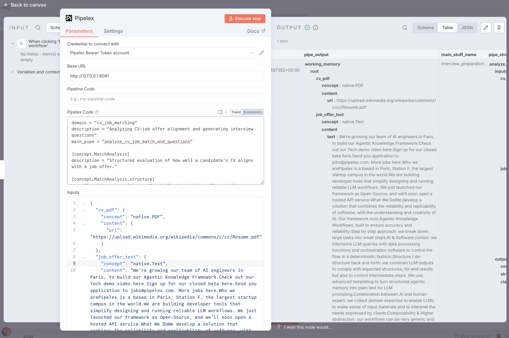
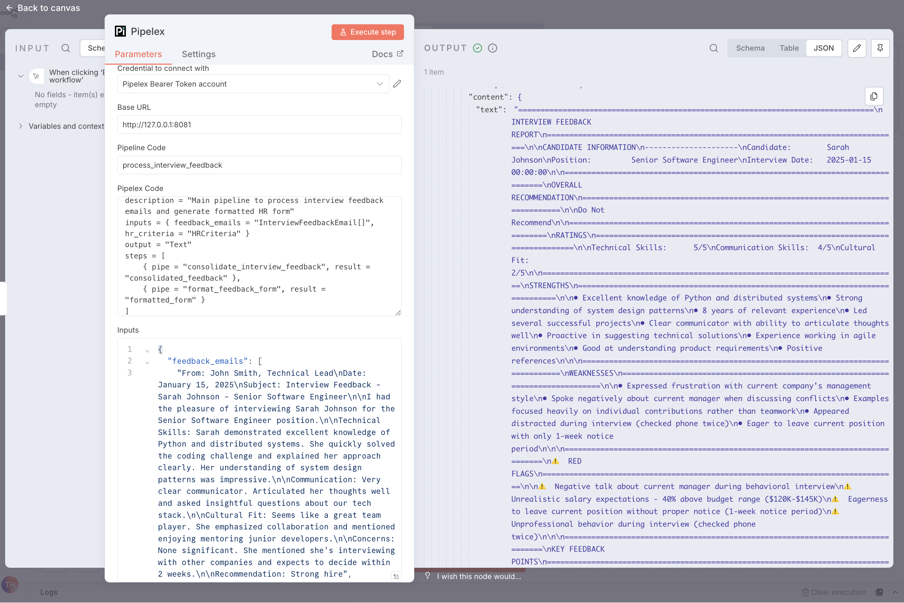

# Pipelex n8n Node Examples

This page provides real-world examples of using the Pipelex n8n node in workflows.

---

## Example 1: CV-Job Matching & Interview Question Generation

**Use Case:** Automatically analyze how well a candidate's CV matches a job offer and generate relevant interview questions.

### Overview

This pipeline:
1. Extracts text from a CV PDF
2. Analyzes alignment between CV and job requirements
3. Generates targeted interview questions based on gaps and strengths
4. Compiles everything into a comprehensive interview preparation document

### Node Configuration

#### Base URL
```
http://localhost:8081
```
(or your Pipelex API server URL)

#### Pipe Code
Leave empty (we'll use inline PLX content)

#### Pipelex Bundle (plx_content)

<details>
<summary>Click to expand full PLX pipeline definition</summary>

```plx
domain = "cv_job_matching"
description = "Analyzing CV-job offer alignment and generating interview questions"
main_pipe = "analyze_cv_job_match_and_questions"

[concept.MatchAnalysis]
description = "Structured evaluation of how well a candidate's CV aligns with a job offer."

[concept.MatchAnalysis.structure]
overall_match_score = { type = "number", description = "Numerical score representing overall fit between candidate and job (0-100)", required = true }
qualifications_alignment = { type = "text", description = "Assessment of how candidate's education and certifications match job requirements", required = true }
experience_alignment = { type = "text", description = "Evaluation of how candidate's work history aligns with required experience", required = true }
skills_match = { type = "text", description = "Analysis of technical and soft skills match between CV and job requirements", required = true }
identified_gaps = { type = "text", description = "List of requirements from job offer not clearly met by candidate's CV", required = true }
strengths = { type = "text", description = "Key strengths and advantages the candidate brings relative to the position", required = true }

[concept.InterviewQuestion]
description = "A single question to be asked during an interview."

[concept.InterviewQuestion.structure]
question_text = { type = "text", description = "The actual question to ask the candidate", required = true }
purpose = { type = "text", description = "Why this question is being asked (e.g., verify skill, explore gap, assess cultural fit)", required = true }
category = { type = "text", description = "Type of question (e.g., technical, behavioral, experience-based, gap-exploration)", required = true }

[concept.InterviewPreparation]
description = "Complete document containing match analysis and recommended interview questions."
refines = "Text"

[pipe.analyze_cv_job_match_and_questions]
type = "PipeSequence"
description = """
Main pipeline that orchestrates the complete CV-job matching analysis and interview preparation workflow. Takes a CV PDF file and job offer text as inputs, extracts text from the CV, performs comprehensive match analysis, generates targeted interview questions, and compiles everything into a final interview preparation document. This is the entry point for the entire pipeline.
"""
inputs = { cv_pdf = "PDF", job_offer_text = "Text" }
output = "InterviewPreparation"
steps = [
    { pipe = "extract_cv_text", result = "cv_pages" },
    { pipe = "analyze_match", result = "match_analysis" },
    { pipe = "generate_interview_questions", result = "interview_questions" },
    { pipe = "compile_results", result = "interview_preparation" },
]

[pipe.extract_cv_text]
type = "PipeExtract"
description = """
Extracts text content from the CV PDF document, converting it into a list of pages that can be analyzed. This pipe processes the PDF file and outputs structured page content with text extracted from each page of the CV.
"""
inputs = { cv_pdf = "PDF" }
output = "Page[]"
model = "extract_text_from_pdf"

[pipe.analyze_match]
type = "PipeLLM"
description = """
Analyzes the match between the candidate's CV and the job offer by evaluating qualifications alignment, experience alignment, skills match, and identifying gaps. Produces a structured MatchAnalysis object with an overall match score (0-100), detailed assessments of how the candidate's education, certifications, work history, and skills align with job requirements, identified gaps where requirements are not clearly met, and key strengths the candidate brings to the position.
"""
inputs = { cv_pages = "Page[]", job_offer_text = "Text" }
output = "MatchAnalysis"
model = "llm_to_answer_hard_questions"
system_prompt = """
You are an expert HR analyst and recruiter specializing in candidate evaluation. Your task is to produce a structured MatchAnalysis that comprehensively evaluates how well a candidate's CV aligns with a job offer.
"""
prompt = """
Analyze how well the candidate's CV matches the job offer requirements.

@cv_pages

@job_offer_text

Perform a comprehensive evaluation covering:
- Overall match score (0-100)
- How qualifications (education, certifications) align with requirements
- How work experience aligns with required experience
- Technical and soft skills match
- Gaps where requirements are not clearly met
- Key strengths the candidate brings

Be thorough and objective in your assessment.
"""

[pipe.generate_interview_questions]
type = "PipeLLM"
description = """
Generates a comprehensive list of relevant interview questions based on the match analysis and job offer. Questions are designed to explore identified gaps, verify claimed strengths and skills, assess experience depth, and clarify areas requiring further investigation. Each question includes the question text, its purpose, and category (technical, behavioral, experience-based, or gap-exploration).
"""
inputs = { match_analysis = "MatchAnalysis", job_offer_text = "Text" }
output = "InterviewQuestion[]"
model = "llm_to_write_questions"
system_prompt = """
You are an expert HR professional and interviewer. Your task is to generate structured InterviewQuestion objects based on the match analysis and job requirements.
"""
prompt = """
Based on the match analysis and job offer, generate a comprehensive list of interview questions.

@match_analysis

@job_offer_text

Generate interview questions that:
- Explore identified gaps and missing qualifications
- Verify claimed strengths and skills from the CV
- Assess depth of relevant experience
- Clarify areas requiring further investigation
- Include a mix of technical, behavioral, experience-based, and gap-exploration questions

Ensure each question is purposeful and directly tied to evaluating the candidate's fit for this specific role.
"""

[pipe.compile_results]
type = "PipeLLM"
description = """
Compiles the match analysis and generated interview questions into a final comprehensive interview preparation document. This document provides a complete overview for interviewers, combining the structured match analysis with the recommended questions to facilitate an effective interview process.
"""
inputs = { match_analysis = "MatchAnalysis", interview_questions = "InterviewQuestion[]" }
output = "InterviewPreparation"
model = "llm_to_answer_easy_questions"
system_prompt = """
You are compiling a comprehensive interview preparation document. Your task is to synthesize the match analysis and interview questions into a well-structured, professional document that will guide interviewers through an effective interview process.
"""
prompt = """
Create a comprehensive interview preparation document that combines the following match analysis and interview questions.

@match_analysis

@interview_questions

Compile these elements into a cohesive interview preparation document that provides interviewers with a complete overview of the candidate's fit and the recommended questions to explore during the interview.
"""
```

</details>

#### Inputs

```json
{
  "cv_pdf": {
    "concept": "native.PDF",
    "content": {
      "url": "https://upload.wikimedia.org/wikipedia/commons/c/cc/Resume.pdf"
    }
  },
  "job_offer_text": {
    "concept": "native.Text",
    "content": "GenAI Engineer - Pipelex (Paris)\n\nWe're growing our team of AI engineers in Paris, to build our Agentic Knowledge Framework.\n\n[Full job description: https://pipelex.notion.site/genai-engineer-job-startup-paris]\n\nKey requirements:\n- Strong Python skills\n- Experience with LLMs and AI frameworks\n- Ability to ship fast and iterate\n- Knowledge of software architecture\n- Passion for building developer tools\n\n..."
  }
}
```

> Here is the full job offer [link](https://pipelex.notion.site/genai-engineer-job-startup-paris).

#### Output Name
Leave empty (we'll use the default output name)

#### Output Multiplicity
Leave empty

### Screenshot: Node Configuration

Here's what the configured Pipelex node looks like in n8n:



The screenshot shows:
- **Credential**: Pipelex Bearer Token account selected
- **Base URL**: `http://127.0.0.1:8081` (local API server)
- **Pipelex Bundle**: Full pipeline definition in the text area
- **Inputs**: JSON object with `cv_pdf` and `job_offer_text` properly formatted
- **Output**: Successful execution showing the interview preparation document

### Expected Output

The pipeline returns an `InterviewPreparation` document containing:

```json
{
  "interview_preparation": {
    "concept": "cv_job_matching.InterviewPreparation",
    "content": {
      "text": "INTERVIEW PREPARATION DOCUMENT\n\n=== MATCH ANALYSIS ===\n\nOverall Match Score: 78/100\n\nQualifications Alignment:\n- Strong computer science background...\n\nExperience Alignment:\n- 5 years of software development experience...\n\nSkills Match:\n- Python: Excellent match\n- LLM frameworks: Demonstrated experience...\n\nIdentified Gaps:\n- Limited mention of specific AI agent architectures\n- No explicit mention of Paris location preference\n\nStrengths:\n- Strong technical foundation in Python and ML\n- Proven track record of shipping products...\n\n=== RECOMMENDED INTERVIEW QUESTIONS ===\n\n1. [Technical] Can you describe your experience building production LLM systems?\n   Purpose: Verify claimed LLM experience\n   Category: technical\n\n2. [Behavioral] Tell us about a time you had to ship a feature quickly. How did you balance speed with quality?\n   Purpose: Assess alignment with 'ship, ship, ship' value\n   Category: behavioral\n\n3. [Gap Exploration] We see you have strong Python experience, but could you elaborate on your exposure to AI agent architectures?\n   Purpose: Explore identified gap in agent architecture knowledge\n   Category: gap-exploration\n\n..."
    }
  }
}
```

### Processing the Results

After the Pipelex node, you can:

1. **Send to HR team:**
   ```
   Pipelex → Email node (send interview doc to hiring manager)
   ```

2. **Store in database:**
   ```
   Pipelex → Set node (extract fields) → Database node (save)
   ```

3. **Send an email** 
You would need to templatise the email using a `PipeCompose`. Look at Example #2 for a more detailed example.

---

## Example 2: Interview Feedback Consolidation

**Use Case:** Consolidate multiple interview feedback emails into a single structured HR report with ratings, red flags, and recommendations.

### Overview

This pipeline:
1. Processes multiple interview feedback emails from different interviewers
2. Evaluates feedback against HR criteria and identifies red flags
3. Generates structured ratings and recommendations
4. Formats everything into a professional HR feedback form

### Node Configuration

#### Base URL
```
http://localhost:8081
```

#### Pipe Code
```
process_interview_feedback
```
(or leave empty to use inline PLX content)

#### Pipelex Bundle (plx_content)

<details>
<summary>Click to expand full PLX pipeline definition</summary>

```plx
domain = "interview_feedback"
description = "Process multiple interview feedback emails and generate a consolidated HR feedback form"

[concept]
InterviewFeedbackEmail = "An email containing feedback from an interviewer about a candidate"
HRCriteria = "HR requirements and red flags to evaluate candidates against"

[concept.ConsolidatedFeedback]
description = "Structured feedback form consolidating all interviewer inputs"

[concept.ConsolidatedFeedback.structure]
candidate_name = "The name of the candidate"
position = "The position the candidate is interviewing for"
interview_date = { type = "date", description = "Date of the interview process" }
overall_recommendation = { type = "text", description = "Overall hiring recommendation: Strongly Recommend, Recommend, Neutral, Do Not Recommend", choices = ["Strongly Recommend", "Recommend", "Neutral", "Do Not Recommend"] }
technical_skills_rating = { type = "integer", description = "Technical skills rating from 1-5" }
communication_skills_rating = { type = "integer", description = "Communication skills rating from 1-5" }
cultural_fit_rating = { type = "integer", description = "Cultural fit rating from 1-5" }
strengths = { type = "list", item_type = "text", description = "List of candidate strengths identified across all interviews" }
weaknesses = { type = "list", item_type = "text", description = "List of candidate weaknesses identified across all interviews" }
red_flags = { type = "list", item_type = "text", description = "List of red flags identified based on HR criteria", required = false }
interviewer_consensus = "Summary of consensus or disagreements among interviewers"
key_feedback_points = { type = "list", item_type = "text", description = "Key feedback points from all interviewers" }
next_steps = "Recommended next steps in the hiring process"
additional_notes = { type = "text", description = "Any additional notes or context", required = false }

[pipe]
[pipe.process_interview_feedback]
type = "PipeSequence"
description = "Main pipeline to process interview feedback emails and generate formatted HR form"
inputs = { feedback_emails = "InterviewFeedbackEmail[]", hr_criteria = "HRCriteria" }
output = "Text"
steps = [
    { pipe = "consolidate_interview_feedback", result = "consolidated_feedback" },
    { pipe = "format_feedback_form", result = "formatted_form" }
]

[pipe.consolidate_interview_feedback]
type = "PipeLLM"
description = "Consolidate multiple interview feedback emails and evaluate against HR criteria"
inputs = { feedback_emails = "InterviewFeedbackEmail[]", hr_criteria = "HRCriteria" }
output = "ConsolidatedFeedback"
model = { model = "base-claude", temperature = 0.3, max_tokens = "auto" }
prompt = """
You are an HR professional tasked with consolidating multiple interview feedback emails for a candidate.

Your goal is to:
1. Extract key information from all interviewer feedbacks
2. Identify common themes, strengths, and weaknesses
3. Check for red flags based on the HR criteria provided
4. Provide a clear overall recommendation
5. Rate the candidate on technical skills, communication, and cultural fit

HR Criteria and Red Flags to consider:

@hr_criteria

Interview Feedback Emails:

@feedback_emails

Please analyze all the feedback carefully and create a comprehensive consolidated feedback form.
Ensure you identify any red flags that match the HR criteria.
Provide balanced ratings and clear next steps.
"""

[pipe.format_feedback_form]
type = "PipeCompose"
description = "Format the consolidated feedback into a professional HR feedback form"
inputs = { consolidated_feedback = "ConsolidatedFeedback" }
output = "Text"
template = """
================================================================================
                        INTERVIEW FEEDBACK REPORT
================================================================================

CANDIDATE INFORMATION
---------------------
Candidate:        $consolidated_feedback.candidate_name
Position:         $consolidated_feedback.position
Interview Date:   $consolidated_feedback.interview_date

================================================================================
OVERALL RECOMMENDATION
================================================================================

$consolidated_feedback.overall_recommendation

================================================================================
RATINGS
================================================================================

Technical Skills:      $consolidated_feedback.technical_skills_rating/5
Communication Skills:  $consolidated_feedback.communication_skills_rating/5
Cultural Fit:          $consolidated_feedback.cultural_fit_rating/5

================================================================================
STRENGTHS
================================================================================


• {{ strength }}


================================================================================
WEAKNESSES
================================================================================


• {{ weakness }}



================================================================================
⚠️  RED FLAGS
================================================================================


⚠️  {{ flag }}



================================================================================
KEY FEEDBACK POINTS
================================================================================


• {{ point }}


================================================================================
INTERVIEWER CONSENSUS
================================================================================

$consolidated_feedback.interviewer_consensus

================================================================================
NEXT STEPS
================================================================================

$consolidated_feedback.next_steps


================================================================================
ADDITIONAL NOTES
================================================================================

$consolidated_feedback.additional_notes


================================================================================
Confidential - HR Internal Use Only
================================================================================
"""
```

</details>

#### Inputs

```json
{
  "feedback_emails": [
    "From: John Smith, Technical Lead\nDate: January 15, 2025\nSubject: Interview Feedback - Sarah Johnson - Senior Software Engineer\n\nI had the pleasure of interviewing Sarah Johnson for the Senior Software Engineer position.\n\nTechnical Skills: Sarah demonstrated excellent knowledge of Python and distributed systems. She quickly solved the coding challenge and explained her approach clearly. Her understanding of system design patterns was impressive.\n\nCommunication: Very clear communicator. Articulated her thoughts well and asked insightful questions about our tech stack.\n\nCultural Fit: Seems like a great team player. She emphasized collaboration and mentioned enjoying mentoring junior developers.\n\nConcerns: None significant. She mentioned she's interviewing with other companies and expects to decide within 2 weeks.\n\nRecommendation: Strong hire",
    
    "From: Maria Garcia, Product Manager\nDate: January 15, 2025\nSubject: Re: Sarah Johnson Interview\n\nHi HR Team,\n\nI met with Sarah to discuss product collaboration and her experience working with PMs.\n\nStrengths:\n- Great at understanding product requirements\n- Proactive in suggesting technical solutions\n- Experience working in agile environments\n\nAreas of concern:\n- She mentioned some frustration with her current company's management style\n- Seemed eager to leave quickly - mentioned a 1-week notice period\n\nOverall: I think she'd be a good fit, but we should understand better why she's leaving so quickly.\n\nRecommendation: Recommend with some reservations",
    
    "From: David Chen, Engineering Manager\nDate: January 16, 2025\nSubject: Interview Feedback - Sarah Johnson\n\nTeam,\n\nI conducted the behavioral interview with Sarah.\n\nStrong points:\n- 8 years of relevant experience\n- Led several successful projects\n- Good problem-solving examples\n- References check out positively\n\nRed flags:\n- When asked about conflicts, she spoke negatively about her current manager\n- Mentioned salary expectations that are 40% above our range\n- Seemed distracted during the interview, checked her phone twice\n\nCultural fit: Mixed signals. She talks about teamwork but her examples focused heavily on individual contributions.\n\nDecision: I'm on the fence. The technical skills are there, but the attitude concerns me."
  ],
  "hr_criteria": "HR Evaluation Criteria:\n\nRED FLAGS TO WATCH FOR:\n- Negative talk about previous employers or managers\n- Unrealistic salary expectations (>20% above budget)\n- Short tenure at previous companies (< 1 year)\n- Unprofessional behavior during interviews\n- Eagerness to leave current position without proper notice\n- Inconsistent information across interviews\n\nPOSITIVE INDICATORS:\n- Strong technical skills matching job requirements\n- Good cultural fit with team values\n- Professional communication\n- Collaborative mindset\n- Reasonable salary expectations\n- Proper notice period at current employer\n\nSALARY BUDGET: $120,000 - $145,000\nPOSITION: Senior Software Engineer\nREQUIRED SKILLS: Python, Distributed Systems, Team Leadership"
}
```

> **💡 Tip:** In a real n8n workflow, you could fetch these emails from Gmail/Outlook using their respective nodes, or from a database where feedback forms are stored.

#### Output Name
Leave empty (uses default `formatted_form`)

#### Output Multiplicity
Leave empty (single document output)

### Screenshot: Node Configuration

Here's what the configured Pipelex node looks like in n8n:



The screenshot shows:
- **Credential**: Pipelex Bearer Token account configured
- **Base URL**: `http://127.0.0.1:8081` (local API server)
- **Pipe Code**: `process_interview_feedback` (using pre-registered pipeline)
- **Inputs**: JSON array with three feedback emails and HR criteria
- **Output**: Successfully formatted HR interview feedback report

### Expected Output

```
================================================================================
                        INTERVIEW FEEDBACK REPORT
================================================================================

CANDIDATE INFORMATION
---------------------
Candidate:        Sarah Johnson
Position:         Senior Software Engineer
Interview Date:   2025-01-15 00:00:00

================================================================================
OVERALL RECOMMENDATION
================================================================================

Neutral

================================================================================
RATINGS
================================================================================

Technical Skills:      5/5
Communication Skills:  4/5
Cultural Fit:          2/5

================================================================================
STRENGTHS
================================================================================

• Excellent knowledge of Python and distributed systems
• Strong system design understanding
• Clear communicator and articulates thoughts well
• 8 years of relevant experience
• Led several successful projects
• Good at understanding product requirements
• Proactive in suggesting technical solutions
• Experience mentoring junior developers
• Positive references


================================================================================
WEAKNESSES
================================================================================

• Expressed frustration with current company's management
• Examples focused heavily on individual contributions rather than teamwork
• Appeared distracted during interview (checked phone twice)
• Eager to leave current position quickly


================================================================================
⚠️  RED FLAGS
================================================================================

⚠️  Negative talk about current manager when discussing conflicts
⚠️  Unrealistic salary expectations - 40% above budget range ($120k-$145k)
⚠️  Eagerness to leave current position with only 1-week notice period
⚠️  Unprofessional behavior - checked phone twice during interview


================================================================================
KEY FEEDBACK POINTS
================================================================================

• Demonstrated excellent technical skills in Python and distributed systems
• Solved coding challenge quickly with clear explanations
• Strong understanding of product requirements and agile environments
• Mentioned frustration with current management style
• Spoke negatively about current manager during behavioral interview
• Salary expectations are 40% above the budgeted range
• Willing to provide only 1-week notice to current employer
• Checked phone twice during interview showing lack of focus
• Interviewing with other companies with 2-week decision timeline
• Mixed signals on cultural fit - talks about teamwork but examples show individual focus


================================================================================
INTERVIEWER CONSENSUS
================================================================================

Significant disagreement among interviewers. Technical Lead (John Smith) gave strong positive recommendation with no concerns. Product Manager (Maria Garcia) recommended with reservations about quick departure timeline. Engineering Manager (David Chen) is on the fence due to attitude and professionalism concerns despite strong technical skills. All agree on technical competence, but behavioral and cultural fit assessments vary considerably.

================================================================================
NEXT STEPS
================================================================================

Schedule follow-up conversation with HR to address red flags: 1) Clarify salary expectations and discuss budget constraints ($120k-$145k range), 2) Understand reasons for leaving current position and negative comments about management, 3) Discuss appropriate notice period expectations, 4) Assess cultural fit more thoroughly regarding teamwork vs individual contribution preferences. If candidate can address these concerns satisfactorily, consider moving forward with reference checks focused on professionalism and teamwork. Otherwise, recommend not proceeding with offer.

================================================================================
ADDITIONAL NOTES
================================================================================

While Sarah demonstrates strong technical capabilities that match job requirements, multiple red flags align with HR criteria that warrant serious consideration. The combination of unrealistic salary expectations (significantly exceeding budget), negative talk about current management, inadequate notice period, and unprofessional interview behavior present substantial concerns. The discrepancy between stated collaborative values and actual examples of individual-focused work also raises questions about cultural alignment. Decision timeline is tight (2 weeks) due to other opportunities candidate is pursuing.

================================================================================
Confidential - HR Internal Use Only
====================================================
```

### Processing the Results

**Workflow options:**

1. **Email to hiring committee:**
   ```
   Pipelex → Email node → Send to HR team + hiring managers
   ```

2. **Store in HR system:**
   ```
   Pipelex → Parse JSON → Database node → Store in candidate records
   ```

3. **Notify on Slack:**
   ```
   Pipelex → Slack node → Post summary in #hiring-decisions channel
   ```

4. **Generate PDF report:**
   ```
   Pipelex → HTTP Request node (HTML to PDF API) → Save to Google Drive
   ```

---

## More Examples Coming Soon

- Document extraction and classification
- Batch invoice processing
- Content generation with multiple variations
- Real-time data enrichment

For more pipeline examples, visit the [Pipelex Cookbook](https://docs.pipelex.com/pages/cookbook-examples/).